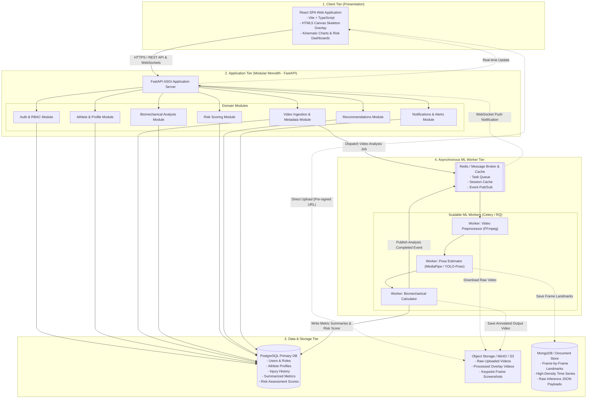

# System Architecture: Sports Injury Risk Detection Platform

**Architecture Pattern:** Modular Monolith  
**Application Tier:** React Frontend $\rightarrow$ FastAPI Backend $\rightarrow$ PostgreSQL Storage  
**Async & Specialized Tiers:** Message Queue / ML Workers, Object Storage, Time-Series Landmark Store (MongoDB)  
**Document Version:** 1.0.0  
**Status:** Approved Specification  

---

## 1. Architectural Strategy & Rationale

### 1.1 Why a Modular Monolith?
For an applied machine learning and sports biomechanics platform undergoing active development, a **Modular Monolith** architecture strikes the optimal balance between engineering velocity and architectural discipline:

- **Strict Domain Boundaries:** The codebase is split into self-contained domain modules (`auth`, `athletes`, `videos`, `biomechanics`, `risk_engine`, `recommendations`, `notifications`). Each module encapsulates its business logic, schemas, and data access.
- **Single Deployment Artifact:** The FastAPI backend runs as a unified ASGI service, simplifying CI/CD pipelines, local developer onboarding, and operational monitoring.
- **Zero Network Latency Between Core Domains:** In-process Python function calls eliminate distributed network latency, serialization overhead, and partial-failure modes common in early microservices.
- **Prepared for Seamless Extraction:** Because compute-heavy workloads (video decoding and neural pose estimation) are decoupled via asynchronous message queues to dedicated ML workers, the system can scale compute independently without re-architecting the web API.

---

## 2. High-Level System Architecture Diagram



---

## 3. Tier & Component Breakdown

### 3.1 Frontend: React Single Page Application (SPA)
- **Technology:** React (TypeScript), Vite, Tailwind CSS, Recharts / Chart.js.
- **Responsibilities:**
  - Responsive user interface tailored to each role (Athlete, Coach, Physiotherapist, Sports Scientist, Admin).
  - Video upload interface supporting pre-signed URL uploads directly to Object Storage with chunking and progress bars.
  - Video Player with **Canvas Skeleton Overlay**: Synchronously renders extracted anatomical landmarks and colored risk vectors over the raw video playback frames.
  - Interactive joint angle timeline charts (e.g., knee flexion curve vs. time, valgus deviation points).
  - Real-time notification banners and risk status alerts via WebSockets.

### 3.2 Backend: FastAPI Modular Monolith
- **Technology:** Python 3.11+, FastAPI, Pydantic v2, SQLAlchemy 2.0 (AsyncIO), Alembic.
- **Responsibilities:**
  - Exposes RESTful endpoints with OpenAPI/Swagger interactive documentation.
  - Enforces Role-Based Access Control (RBAC) and JSON Web Token (JWT) session validation.
  - Coordinates domain workflows, database migrations, and business logic.
  - Issues secure pre-signed upload/download URLs for Object Storage access.
  - Dispatches heavy processing jobs to the asynchronous broker and handles webhook/event callbacks.

#### Internal Modular Structure
```
sports-injury-risk/
└── backend/
    └── app/
        ├── core/                  # Global configuration, security, DB connections
        │   ├── config.py
        │   ├── database.py        # SQLAlchemy engine & session factory
        │   └── security.py        # JWT & password hashing utilities
        ├── modules/               # Isolated domain modules
        │   ├── auth/              # User authentication, RBAC, tokens
        │   ├── athletes/          # Athletes, injury history, training profiles
        │   ├── videos/            # Video ingestion, pre-signed URLs, metadata
        │   ├── biomechanics/      # Kinematic calculation logic & thresholds
        │   ├── risk_engine/       # Multi-factorial risk scoring algorithms
        │   ├── recommendations/   # Corrective exercise matching engine
        │   └── notifications/     # Alerts, email/webhook triggers, WebSockets
        ├── worker/                # Worker tasks and pipeline definitions
        │   ├── celery_app.py
        │   └── tasks.py
        └── main.py                # FastAPI ASGI application assembly
```

### 3.3 Relational Database: PostgreSQL
- **Role:** Primary System of Record.
- **Responsibilities:**
  - Relational entities with strict ACID guarantees: users, athletes, injury history, physical assessments, coach-athlete relationships, and video metadata.
  - Persists high-level summary metrics (e.g., `peak_valgus_angle`, `landing_flexion_angle`, `asymmetry_index`, `risk_score`, `risk_category`).
  - Utilizes indexing, foreign keys, and cascading constraints to maintain referential integrity.

### 3.4 Object Storage (Placeholder & Integration Interface)
- **Technology Options:** MinIO (local/on-premise S3-compatible) or AWS S3 / Cloudflare R2 (cloud).
- **Responsibilities:**
  - Storage of high-capacity binary blobs: raw user-uploaded videos (MP4/MOV), rendered video files with burnt-in visual skeleton overlays, and keyframe snapshot images.
  - Direct client-side video uploading using pre-signed PUT URLs, eliminating backend memory bottlenecks during multi-gigabyte video uploads.

### 3.5 Document & Time-Series Store: MongoDB (Placeholder & Integration Interface)
- **Technology Options:** MongoDB / TimescaleDB.
- **Responsibilities:**
  - High-frequency temporal landmark data storage: Storing 33 full-body landmarks $\times$ 3 coordinates $(x, y, z) \times$ confidence scores across hundreds of frames per video.
  - Unstructured ML inference dumps and debug artifacts that do not fit rigid relational schemas.
  - Fast document querying by `video_id` and `frame_number` for frontend canvas playback reconstruction.

### 3.6 ML Workers & Task Queue (Placeholder & Integration Interface)
- **Technology Options:** Celery / Redis / RQ / RabbitMQ.
- **Responsibilities:**
  - Isolates compute-intensive, memory-heavy workloads from the low-latency web API.
  - **Video Preprocessing Worker:** Uses FFmpeg to extract metadata, normalize frame rates (e.g., 60 FPS), downscale resolution, and extract bounding boxes.
  - **Pose Estimation Worker:** Runs neural network inference (e.g., MediaPipe Pose, YOLOv8-Pose) leveraging GPU acceleration if available.
  - **Biomechanical Calculator Worker:** Processes coordinate time-series, applies digital filters (Butterworth/Savitzky-Golay), calculates joint angles, and writes results to PostgreSQL and MongoDB.

---

## 4. End-to-End Data & Execution Flow

```
[Athlete/Coach]
       |
       | 1. POST /api/v1/videos/upload-request (Metadata)
       v
  [FastAPI] ------------> Returns Pre-signed S3 URL & Video ID
       |
       | 2. Direct PUT Video File
       v
[Object Storage]
       |
       | 3. Client notifies FastAPI: POST /api/v1/videos/{id}/complete
       v
  [FastAPI] ------------> Pushes Task [video_id] to Redis Queue
                                  |
                                  v
                            [Redis Broker]
                                  |
                                  v
                          [ML Celery Worker]
                            ├── 4a. Downloads video from Object Storage
                            ├── 4b. FFmpeg frame normalization
                            ├── 4c. Deep Learning Pose Estimation
                            │       └── Writes raw landmarks to MongoDB
                            ├── 4d. Biomechanical calculations & Risk score
                            │       └── Writes summary & score to PostgreSQL
                            └── 4e. Generates overlay video & uploads to Object Storage
                                  |
                                  | 5. Publishes "job.completed" event
                                  v
  [FastAPI] <--------------------+
       |
       | 6. WebSocket event dispatched to Client
       v
[React Frontend] (Displays Interactive Report & Alerts)
```

---

## 5. Security, Tenancy & Communication Protocols

- **Authentication & RBAC:** OAuth2 with Bearer JWT tokens. Every request validates role permissions before accessing athlete data.
- **Inter-Module Communication:** Synchronous in-memory interfaces using defined Python typing protocols / service classes. No HTTP overhead between internal monolith modules.
- **Asynchronous Task Contracts:** Strictly typed Pydantic payloads for queue message serialization between FastAPI and ML workers.
- **Storage Access Control:** Zero public access to Object Storage. All video reads and writes are gated by short-lived pre-signed URLs generated by FastAPI.
