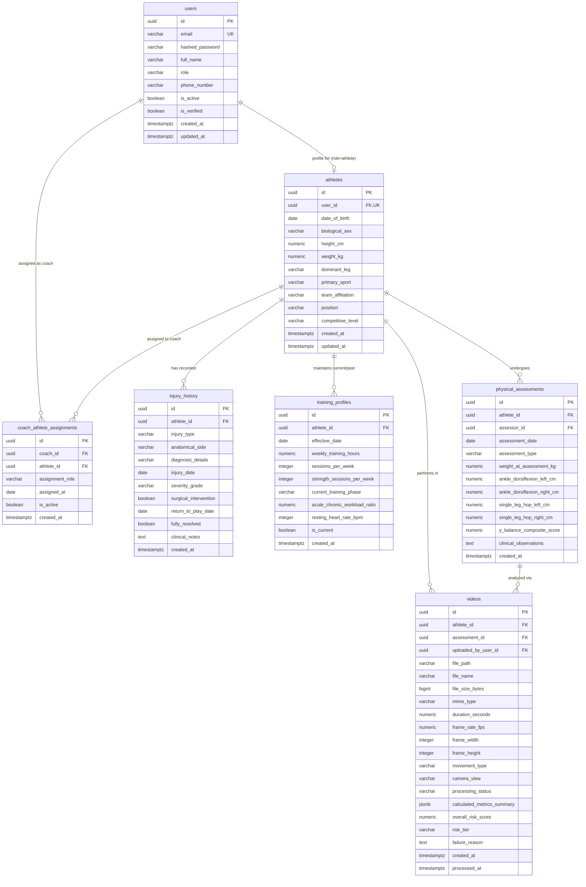

# Database Schema Specification: Sports Injury Risk Detection

**Target RDBMS:** PostgreSQL (15+)  
**Primary Key Convention:** UUID v4 (`gen_random_uuid()`)  
**Timezone Standard:** UTC (`TIMESTAMP WITH TIME ZONE`)  
**Document Version:** 1.0.0  
**Status:** Approved Specification  

---

## 1. Entity-Relationship (ER) Diagram



---

## 2. Enumerations & Custom Types

Before defining tables, the following standard PostgreSQL ENUM types are utilized:

```sql
CREATE TYPE user_role_enum AS ENUM (
    'admin',
    'coach',
    'physiotherapist',
    'sports_scientist',
    'athlete'
);

CREATE TYPE biological_sex_enum AS ENUM (
    'male',
    'female',
    'other'
);

CREATE TYPE dominant_leg_enum AS ENUM (
    'left',
    'right',
    'ambidextrous'
);

CREATE TYPE anatomical_side_enum AS ENUM (
    'left',
    'right',
    'bilateral'
);

CREATE TYPE injury_type_enum AS ENUM (
    'acl_tear',
    'ankle_sprain',
    'hamstring_strain',
    'patellar_tendinopathy',
    'meniscus_tear',
    'groin_strain',
    'other'
);

CREATE TYPE movement_type_enum AS ENUM (
    'squat',
    'jump_landing',
    'running'
);

CREATE TYPE camera_view_enum AS ENUM (
    'frontal',
    'sagittal',
    'oblique'
);

CREATE TYPE processing_status_enum AS ENUM (
    'pending_upload',
    'uploaded',
    'preprocessing',
    'pose_estimation',
    'biomechanics_calc',
    'completed',
    'failed'
);

CREATE TYPE risk_tier_enum AS ENUM (
    'low',
    'moderate',
    'high'
);
```

---

## 3. Data Dictionary: Table Specifications

### 3.1 `users`
Represents identity, credentials, and role-based permissions for all human actors accessing the platform.

| Column Name | Data Type | Nullable | Constraints & Default | Description |
| :--- | :--- | :--- | :--- | :--- |
| `id` | `UUID` | No | `PRIMARY KEY DEFAULT gen_random_uuid()` | Unique user identifier. |
| `email` | `VARCHAR(255)` | No | `UNIQUE` | Normalized login email address. |
| `hashed_password` | `VARCHAR(255)` | No | | Argon2 or bcrypt hashed password string. |
| `full_name` | `VARCHAR(150)` | No | | User's full display name. |
| `role` | `user_role_enum` | No | | System role governing authorization. |
| `phone_number` | `VARCHAR(30)` | Yes | | Optional contact phone for SMS alerts. |
| `is_active` | `BOOLEAN` | No | `DEFAULT TRUE` | Soft-disable flag for user accounts. |
| `is_verified` | `BOOLEAN` | No | `DEFAULT FALSE` | Email verification confirmation status. |
| `created_at` | `TIMESTAMPTZ` | No | `DEFAULT CURRENT_TIMESTAMP` | Account creation timestamp. |
| `updated_at` | `TIMESTAMPTZ` | No | `DEFAULT CURRENT_TIMESTAMP` | Account last modification timestamp. |

---

### 3.2 `athletes`
Extended anthropometric and athletic profile. Has a 1-to-1 relationship with a `users` record whose `role = 'athlete'`.

| Column Name | Data Type | Nullable | Constraints & Default | Description |
| :--- | :--- | :--- | :--- | :--- |
| `id` | `UUID` | No | `PRIMARY KEY DEFAULT gen_random_uuid()` | Unique athlete profile identifier. |
| `user_id` | `UUID` | No | `UNIQUE REFERENCES users(id) ON DELETE CASCADE` | Associated user identity record. |
| `date_of_birth` | `DATE` | No | | Birth date (used for age-normative data). |
| `biological_sex` | `biological_sex_enum` | No | | Biological sex for anatomical benchmarks. |
| `height_cm` | `NUMERIC(5,2)` | No | `CHECK (height_cm > 50 AND height_cm < 260)` | Stature in centimeters. |
| `weight_kg` | `NUMERIC(5,2)` | No | `CHECK (weight_kg > 20 AND weight_kg < 300)` | Body mass in kilograms. |
| `dominant_leg` | `dominant_leg_enum` | No | `DEFAULT 'right'` | Limb dominance for asymmetry baselines. |
| `primary_sport` | `VARCHAR(100)` | No | | e.g., 'Soccer', 'Basketball', 'Track & Field'. |
| `team_affiliation` | `VARCHAR(150)` | Yes | | Organization or club team name. |
| `position` | `VARCHAR(80)` | Yes | | Field position (e.g., 'Point Guard', 'Winger'). |
| `competitive_level`| `VARCHAR(50)` | No | `DEFAULT 'collegiate'` | 'high_school', 'collegiate', 'elite', 'recreational'. |
| `created_at` | `TIMESTAMPTZ` | No | `DEFAULT CURRENT_TIMESTAMP` | Record creation timestamp. |
| `updated_at` | `TIMESTAMPTZ` | No | `DEFAULT CURRENT_TIMESTAMP` | Profile update timestamp. |

---

### 3.3 `injury_history`
Granular historical records of past injuries. Vital for multi-factor risk weighting (prior injury is the strongest clinical predictor of re-injury).

| Column Name | Data Type | Nullable | Constraints & Default | Description |
| :--- | :--- | :--- | :--- | :--- |
| `id` | `UUID` | No | `PRIMARY KEY DEFAULT gen_random_uuid()` | Unique injury record ID. |
| `athlete_id` | `UUID` | No | `REFERENCES athletes(id) ON DELETE CASCADE` | Associated athlete. |
| `injury_type` | `injury_type_enum` | No | | Standardized classification of injury. |
| `anatomical_side` | `anatomical_side_enum`| No | | Laterality ('left', 'right', 'bilateral'). |
| `diagnosis_details`| `VARCHAR(255)` | Yes | | Specific clinical diagnosis (e.g. 'Grade II ATFL Sprain'). |
| `injury_date` | `DATE` | No | | Approximate date when injury occurred. |
| `severity_grade` | `VARCHAR(20)` | Yes | | Clinical grade ('Grade I', 'Grade II', 'Grade III / Complete Tear'). |
| `surgical_intervention` | `BOOLEAN` | No | `DEFAULT FALSE` | Flag indicating whether surgery was performed. |
| `return_to_play_date` | `DATE` | Yes | | Date medically cleared for competition. |
| `fully_resolved` | `BOOLEAN` | No | `DEFAULT TRUE` | False if currently in active rehabilitation. |
| `clinical_notes` | `TEXT` | Yes | | Free-text observations from physiotherapist. |
| `created_at` | `TIMESTAMPTZ` | No | `DEFAULT CURRENT_TIMESTAMP` | Record entry timestamp. |

---

### 3.4 `training_profiles`
Captures training volume, frequency, and acute-to-chronic workload metrics over time to evaluate fatigue-related injury risk.

| Column Name | Data Type | Nullable | Constraints & Default | Description |
| :--- | :--- | :--- | :--- | :--- |
| `id` | `UUID` | No | `PRIMARY KEY DEFAULT gen_random_uuid()` | Unique training profile ID. |
| `athlete_id` | `UUID` | No | `REFERENCES athletes(id) ON DELETE CASCADE` | Associated athlete. |
| `effective_date` | `DATE` | No | `DEFAULT CURRENT_DATE` | Date this profile became active. |
| `weekly_training_hours` | `NUMERIC(4,1)` | No | `CHECK (weekly_training_hours >= 0)` | Total practice & conditioning hours/week. |
| `sessions_per_week` | `INTEGER` | No | `CHECK (sessions_per_week >= 1)` | Number of training bouts per week. |
| `strength_sessions_per_week` | `INTEGER` | No | `DEFAULT 2` | Dedicated resistance training bouts/week. |
| `current_training_phase` | `VARCHAR(50)` | No | `DEFAULT 'in_season'` | 'off_season', 'pre_season', 'in_season', 'taper'. |
| `acute_chronic_workload_ratio`| `NUMERIC(4,2)` | Yes | `CHECK (acute_chronic_workload_ratio >= 0)` | Rolling ACWR metric (sweet spot 0.8 - 1.3). |
| `resting_heart_rate_bpm` | `INTEGER` | Yes | | Morning resting heart rate (autonomic proxy). |
| `is_current` | `BOOLEAN` | No | `DEFAULT TRUE` | Quick pointer to athlete's active training regime. |
| `created_at` | `TIMESTAMPTZ` | No | `DEFAULT CURRENT_TIMESTAMP` | Record creation timestamp. |

---

### 3.5 `physical_assessments`
Clinical physical screening measurements recorded by a physiotherapist or athletic trainer (e.g., joint mobility, strength, and hop symmetry).

| Column Name | Data Type | Nullable | Constraints & Default | Description |
| :--- | :--- | :--- | :--- | :--- |
| `id` | `UUID` | No | `PRIMARY KEY DEFAULT gen_random_uuid()` | Unique assessment ID. |
| `athlete_id` | `UUID` | No | `REFERENCES athletes(id) ON DELETE CASCADE` | Athlete assessed. |
| `assessor_id` | `UUID` | No | `REFERENCES users(id) ON DELETE RESTRICT` | Clinician / physiotherapist who administered screen. |
| `assessment_date` | `DATE` | No | `DEFAULT CURRENT_DATE` | Date of evaluation. |
| `assessment_type` | `VARCHAR(80)` | No | `DEFAULT 'pre_season_baseline'` | 'pre_season_baseline', 'periodic_screen', 'return_to_play'. |
| `weight_at_assessment_kg` | `NUMERIC(5,2)` | Yes | | Measured body mass at assessment time. |
| `ankle_dorsiflexion_left_cm`| `NUMERIC(4,1)` | Yes | | Weight-bearing lunge distance to wall (left). |
| `ankle_dorsiflexion_right_cm`| `NUMERIC(4,1)` | Yes | | Weight-bearing lunge distance to wall (right). |
| `single_leg_hop_left_cm` | `NUMERIC(5,1)` | Yes | | Single-leg hop for distance (left limb). |
| `single_leg_hop_right_cm` | `NUMERIC(5,1)` | Yes | | Single-leg hop for distance (right limb). |
| `y_balance_composite_score` | `NUMERIC(5,2)` | Yes | | Dynamic postural balance composite score (%). |
| `clinical_observations` | `TEXT` | Yes | | Clinician qualitative diagnostic notes. |
| `created_at` | `TIMESTAMPTZ` | No | `DEFAULT CURRENT_TIMESTAMP` | Assessment creation timestamp. |

---

### 3.6 `coach_athlete_assignments`
Associative junction entity establishing many-to-many relationships between coaches/physios and athletes.

| Column Name | Data Type | Nullable | Constraints & Default | Description |
| :--- | :--- | :--- | :--- | :--- |
| `id` | `UUID` | No | `PRIMARY KEY DEFAULT gen_random_uuid()` | Unique assignment ID. |
| `coach_id` | `UUID` | No | `REFERENCES users(id) ON DELETE CASCADE` | User record with role `coach` or `physiotherapist`. |
| `athlete_id` | `UUID` | No | `REFERENCES athletes(id) ON DELETE CASCADE` | Associated athlete. |
| `assignment_role` | `VARCHAR(50)` | No | `DEFAULT 'head_coach'` | Role label ('head_coach', 'strength_coach', 'lead_physio'). |
| `assigned_at` | `DATE` | No | `DEFAULT CURRENT_DATE` | Date assignment commenced. |
| `is_active` | `BOOLEAN` | No | `DEFAULT TRUE` | Active roster status flag. |
| `created_at` | `TIMESTAMPTZ` | No | `DEFAULT CURRENT_TIMESTAMP` | Assignment creation timestamp. |

*Unique Constraint:* `UNIQUE (coach_id, athlete_id, assignment_role)` ensures no duplicate active assignments.

---

### 3.7 `videos`
Central asset tracking uploaded movement trials, video encoding metadata, pipeline processing states, and summarized biomechanical outputs.

| Column Name | Data Type | Nullable | Constraints & Default | Description |
| :--- | :--- | :--- | :--- | :--- |
| `id` | `UUID` | No | `PRIMARY KEY DEFAULT gen_random_uuid()` | Unique video trial ID. |
| `athlete_id` | `UUID` | No | `REFERENCES athletes(id) ON DELETE CASCADE` | Athlete performing movement. |
| `assessment_id` | `UUID` | Yes | `REFERENCES physical_assessments(id) ON DELETE SET NULL` | Optional linked clinical assessment session. |
| `uploaded_by_user_id`| `UUID` | No | `REFERENCES users(id) ON DELETE RESTRICT` | User who uploaded video file. |
| `file_path` | `VARCHAR(512)` | No | | Object Storage URI/key for raw video. |
| `file_name` | `VARCHAR(255)` | No | | Original uploaded filename. |
| `file_size_bytes` | `BIGINT` | No | | File size in bytes for storage quota accounting. |
| `mime_type` | `VARCHAR(50)` | No | `DEFAULT 'video/mp4'` | Content MIME type (e.g. 'video/mp4', 'video/quicktime'). |
| `duration_seconds` | `NUMERIC(5,2)` | Yes | | Video playback duration. |
| `frame_rate_fps` | `NUMERIC(5,2)` | Yes | | Video FPS (e.g., 30.0, 60.0, 120.0). |
| `frame_width` | `INTEGER` | Yes | | Pixel width (e.g., 1920). |
| `frame_height` | `INTEGER` | Yes | | Pixel height (e.g., 1080). |
| `movement_type` | `movement_type_enum` | No | | Targeted movement: `squat`, `jump_landing`, `running`. |
| `camera_view` | `camera_view_enum` | No | `DEFAULT 'frontal'` | Perspective: `frontal`, `sagittal`, `oblique`. |
| `processing_status`| `processing_status_enum`| No | `DEFAULT 'pending_upload'`| Pipeline state machine progression. |
| `calculated_metrics_summary` | `JSONB` | Yes | | JSON document storing computed peak kinematic angles (valgus, flexion, asymmetry). |
| `overall_risk_score`| `NUMERIC(5,2)` | Yes | `CHECK (overall_risk_score >= 0 AND overall_risk_score <= 100)` | Composite injury risk score (0.00 to 100.00). |
| `risk_tier` | `risk_tier_enum` | Yes | | Categorical risk grade: `low`, `moderate`, `high`. |
| `failure_reason` | `TEXT` | Yes | | Detailed error log if `processing_status = 'failed'`. |
| `created_at` | `TIMESTAMPTZ` | No | `DEFAULT CURRENT_TIMESTAMP` | Initial upload record creation timestamp. |
| `processed_at` | `TIMESTAMPTZ` | Yes | | Timestamp when ML worker concluded analysis. |

---

## 4. Indexing & Query Optimization Strategy

To support fast dashboard queries and high-frequency analytical lookups, the following indexes are specified:

```sql
-- Athlete Lookups
CREATE INDEX idx_athletes_user_id ON athletes(user_id);
CREATE INDEX idx_athletes_team ON athletes(team_affiliation);

-- Injury History Lookups
CREATE INDEX idx_injury_history_athlete_id ON injury_history(athlete_id);
CREATE INDEX idx_injury_history_type ON injury_history(injury_type);

-- Coach Athlete Roster Queries
CREATE INDEX idx_coach_athlete_coach_id ON coach_athlete_assignments(coach_id);
CREATE INDEX idx_coach_athlete_athlete_id ON coach_athlete_assignments(athlete_id);

-- Video Processing Queue & Filtering
CREATE INDEX idx_videos_athlete_id ON videos(athlete_id);
CREATE INDEX idx_videos_status ON videos(processing_status) WHERE processing_status != 'completed';
CREATE INDEX idx_videos_risk_tier ON videos(risk_tier);
CREATE INDEX idx_videos_movement_created ON videos(movement_type, created_at DESC);

-- GIN Index for Fast JSONB Metric Searching
CREATE INDEX idx_videos_metrics_gin ON videos USING gin (calculated_metrics_summary);
```
