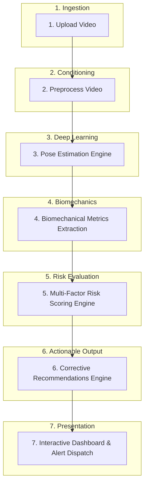

# Project Brief: Sports Injury Risk Detection from Video

**Project Name:** Sports Injury Risk Detection from Video  
**Project Type:** Applied Computer Vision & Sports Biomechanics Internship Project  
**Target Domain:** Sports Medicine, Athletic Performance, Computer Vision  
**Document Version:** 1.0.0  
**Status:** Approved Specification  

---

## 1. Executive Summary & Problem Statement

### 1.1 Problem Statement
Musculoskeletal injuries—specifically non-contact Anterior Cruciate Ligament (ACL) tears, lateral ankle sprains, and hamstring strain injuries—represent the highest burden of time-loss, surgical intervention, and financial cost across competitive, collegiate, and recreational sports. A substantial proportion of these injuries are non-contact events triggered by aberrant movement kinematics and neuromuscular deficits, such as:
- Excessive dynamic knee valgus and stiff landing patterns during jump landings and deceleration.
- Extreme ankle inversion coupled with plantarflexion and lateral postural instability during foot strike.
- Inefficient lumbopelvic control, anterior pelvic tilt, and excessive knee extension during high-velocity running terminal swing.

### 1.2 Current Limitations in Industry
- **Laboratory Gold Standard (Marker-Based MoCap):** Systems like Vicon or Qualisys offer sub-millimeter 3D joint tracking, but require dedicated laboratory environments, retroreflective skin markers, calibrated multi-camera arrays, and hours of setup/post-processing. They cannot be deployed at scale in field or gym environments.
- **Subjective Observational Screening:** Field screens (e.g., FMS, LESS) rely on human visual observation. They suffer from high inter-rater variability, cannot quantify micro-second kinetic events (such as peak ground contact impact angles), and fail to track longitudinal trends quantitatively.
- **Reactive Rather than Preventive Care:** Most athletic organizations only perform in-depth biomechanical assessments *after* an athlete suffers a catastrophic injury during post-operative return-to-play evaluations.

### 1.3 Proposed Solution
"Sports Injury Risk Detection from Video" is an AI-powered, markerless biomechanical screening platform. Utilizing monocular or synchronized dual-camera standard 2D/3D video feeds (e.g., mobile phones, tablets, standard digital cameras), the system extracts human skeletal keypoints across temporal movement sequences, computes standardized clinical biomechanical metrics, predicts multi-factorial injury risk scores, and outputs targeted neuromuscular corrective exercises.

---

## 2. Target Movement Scope & Injury Risk Profiles

The platform narrows its analytical focus to three foundational functional movements and three high-incidence non-contact lower-extremity injury profiles:

### 2.1 Movement Scope
| Movement Type | Functional Description | Typical Assessment Protocols |
| :--- | :--- | :--- |
| **Squat** | Bilateral compound closed-chain movement testing core, hip, knee, and ankle mobility/stability. | Overhead Squat, Deep Bodyweight Squat (frontal and sagittal views). |
| **Jump Landing** | Deceleration and kinetic impact loading test evaluating shock absorption and frontal-plane joint control. | Drop Vertical Jump (DVJ), Countermovement Jump (CMJ), Single-Leg Hop Landing. |
| **Running** | Cyclic gait analysis evaluating high-velocity hip extension/flexion, foot strike mechanics, and pelvic stabilization. | Treadmill gait recording (frontal & sagittal) and sprint acceleration corridor. |

### 2.2 Target Injury Risks & Biomechanical Correlates
| Target Injury | Primary Biomechanical Flags & Kinematic Correlates | Target Movement |
| :--- | :--- | :--- |
| **ACL Tear Risk** | - Dynamic Knee Valgus (frontal plane knee collapse)<br>- Low Knee Flexion Angle at initial contact (stiff landing)<br>- Excessive lateral trunk displacement / contralateral pelvic drop<br>- High bilateral asymmetry in peak landing impact | Jump Landing, Squat, High-Speed Deceleration |
| **Ankle Sprain Risk** | - Ankle inversion angle at foot strike<br>- Rapid supination during early stance phase<br>- Restricted ankle dorsiflexion range of motion (knee-to-wall deficit proxy)<br>- Dynamic balance deficit and center-of-mass shift | Jump Landing, Running foot strike |
| **Hamstring Strain Risk** | - Excessive anterior pelvic tilt during late swing phase<br>- Overstriding (excessive distance between center of mass and foot touchdown)<br>- Hip flexion to knee extension ratio during terminal swing<br>- Asymmetric hip-knee deceleration angular velocity | Running (sprint mechanics), Squat posterior chain loading |

---

## 3. User Roles & Stakeholder Requirements

The platform is designed around five primary personas:

```
                      +-----------------------------+
                      |         Admin User          |
                      | System & Organization Config|
                      +--------------+--------------+
                                     |
         +---------------------------+---------------------------+
         |                           |                           |
+--------v--------+         +--------v--------+         +--------v--------+
|   Head Coach    |         | Physiotherapist |         | Sports Scientist|
| Roster Insights |         | Rehab & Clinical|         | Deep Kinematics |
+--------+--------+         +--------+--------+         +--------+--------+
         |                           |                           |
         +---------------------------+---------------------------+
                                     |
                            +--------v--------+
                            |     Athlete     |
                            | Personal Portal |
                            +-----------------+
```

### 3.1 Athlete
*The primary subject performing assessments and executing corrective plans.*
- **Key Needs:**
  - Self-service video recording and uploading directly from mobile devices.
  - Clear, intuitive, gamified injury risk summaries (e.g., Green/Yellow/Red risk gauge).
  - Visual video playback showing animated joint angle overlays highlighting faulty mechanics.
  - Step-by-step personalized corrective exercise prescription (video demos, sets, repetitions).
  - Historical progress tracking showing risk reduction over training cycles.

### 3.2 Coach
*Oversees team performance, roster availability, and practice programming.*
- **Key Needs:**
  - Team roster dashboard showing collective risk distribution and readiness status.
  - Automated early-warning alerts when an athlete enters "High Risk" status.
  - Group-level movement flaw breakdowns (e.g., "60% of defenders demonstrate poor knee flexion").
  - Workload and drill intensity modification recommendations to avoid fatigue-induced injury spikes.
  - Filterable reports for pre-season screening and weekly readiness checks.

### 3.3 Physiotherapist / Athletic Trainer
*Clinical specialist responsible for injury prevention, diagnostics, and return-to-play rehabilitation.*
- **Key Needs:**
  - Precise clinical metric tables (exact degrees of valgus, flexion, tibial rotation, and asymmetry ratios).
  - Side-by-side comparison tools (baseline pre-injury vs. current assessment, or left vs. right limb).
  - Ability to review, adjust, and append clinical notes to auto-generated risk assessments.
  - Custom rehabilitation / corrective protocol builder with exercise overrides.
  - Comprehensive injury history log and return-to-play clearance workflow.

### 3.4 Sports Scientist / Biomechanist
*Data-driven researcher analyzing longitudinal trends, model accuracy, and kinematic parameters.*
- **Key Needs:**
  - Access to granular time-series kinematic data (frame-by-frame joint coordinates, angular velocities).
  - Configurable risk algorithm weighting and custom metric threshold definitions.
  - Raw and normalized data export capabilities (CSV, JSON, HDF5) for external statistical modeling.
  - Model confidence scores and keypoint tracking reliability indicators.

### 3.5 System Administrator
*Manages platform governance, identity, security, and computing infrastructure.*
- **Key Needs:**
  - Centralized user account management and Role-Based Access Control (RBAC).
  - Organization, team, and roster assignment controls.
  - Audit logging of data access, video retention policies, and compliance (HIPAA/GDPR health privacy).
  - Video processing queue monitoring and compute resource health metrics.

---

## 4. End-to-End Core Workflow

The system executes a strictly staged processing pipeline from video capture to end-user notification:



### 4.1 Step 1: Upload Video
- **Input:** Raw video recorded via smartphone, webcam, or video camera.
- **Supported Formats:** MP4, MOV, AVI (H.264 / H.265 encoded, 30–120 FPS).
- **Metadata Captured:** Athlete ID, exercise category (`squat`, `jump_landing`, `running`), camera perspective (`frontal`, `sagittal`, `oblique`), and session notes.
- **Storage:** Uploaded directly via secure pre-signed URLs to Cloud Object Storage.

### 4.2 Step 2: Preprocess Video
- **Integrity Validation:** MIME-type validation, corrupted frame check, aspect ratio validation.
- **Standardization:** Frame rate normalization (interpolating or standardizing to 30/60 FPS), resolution scaling (downsampling 4K to 1080p/720p to maintain real-time throughput).
- **Region of Interest (ROI) Cropping:** Dynamic human bounding box detection to crop unnecessary scene clutter and center the athlete.
- **Temporal Trimming:** Automatic detection of the active movement repetition cycle (start of descent to completion of ascent/landing stabilization).

### 4.3 Step 3: Pose Estimation
- **Inference Engine:** Markerless temporal pose estimation models (e.g., MediaPipe Pose, YOLOv8-Pose, or RTMPose).
- **Keypoint Tracking:** Extraction of 33 standardized anatomical landmarks (shoulders, elbows, wrists, hips, knees, ankles, heels, toes) with `(x, y, z)` coordinates and model confidence scores `(c)`.
- **Temporal Filtering:** Application of Butterworth low-pass filter or Savitzky-Golay filter to smooth inter-frame keypoint jitter and occlusions.

### 4.4 Step 4: Biomechanical Metrics Extraction
From the smoothed 3D landmark trajectories, domain-specific biomechanical algorithms compute:
- **Knee Valgus Angle:** Frontal plane deviation angle between femur axis (hip-to-knee) and tibial axis (knee-to-ankle).
- **Knee Flexion Depth:** Sagittal plane angle between femur and tibia at peak depth or ground impact.
- **Trunk Lateral Tilt & Forward Lean:** Angle between mid-shoulder to mid-hip vector relative to the vertical gravity vector.
- **Foot Touchdown & Ankle Inversion:** Angle of the heel-to-toe vector relative to the frontal ground plane at initial contact.
- **Bilateral Asymmetry Index:** Percentage difference between left and right limb load distribution and joint angles:
  $$\text{Asymmetry (\%)} = \frac{|\theta_{\text{left}} - \theta_{\text{right}}|}{\max(\theta_{\text{left}}, \theta_{\text{right}})} \times 100$$

### 4.5 Step 5: Multi-Factor Risk Scoring Engine
- The risk scoring engine aggregates:
  1. **Instantaneous Kinematic Penalties:** Threshold breaches (e.g., valgus $> 15^\circ$, knee flexion $< 30^\circ$ at landing).
  2. **Inter-Limb Asymmetry Weighting:** Discrepancies $> 10\%$ in landing absorption.
  3. **Historical Context Weight:** Prior injury records (e.g., previous ACL repair increases ACL vulnerability weight by $1.5\times$).
  4. **Training Load Context:** High acute:chronic workload ratio increases fatigue risk modifier.
- **Output:** Categorical risk tier (`LOW`, `MODERATE`, `HIGH`) and composite numerical score (0 to 100, where 100 represents severe risk).

### 4.6 Step 6: Corrective Recommendations Engine
- Evaluates the top risk-contributing biomechanical deviations and queries a codified knowledge base of evidence-based sports physical therapy protocols.
- **Examples:**
  - *Identified Flaw:* High dynamic knee valgus during jump landing $\rightarrow$ *Prescription:* Mini-band glute bridges, clamshells, and box jump landing deceleration drills emphasizing knee-over-toe alignment.
  - *Identified Flaw:* Stiff landing ($< 35^\circ$ knee flexion) $\rightarrow$ *Prescription:* Eccentric quadriceps loading, soft-landing audio-biofeedback drills.
  - *Identified Flaw:* Excessive anterior pelvic tilt during running $\rightarrow$ *Prescription:* Dead bugs, bird-dogs, half-kneeling hip flexor stretches, and Nordic hamstring curls.

### 4.7 Step 7: Interactive Dashboard & Alerts
- **Athlete View:** Clean summary card with video player, overlaid joint skeleton, key findings, and assigned corrective drill list.
- **Coach / Physio Portal:** Multi-athlete comparative matrix, movement replay with scrub-bar frame stepping, exportable PDF report.
- **Automated Alerts:** Webhook, email, or in-app notification sent immediately when an athlete records a `HIGH` risk assessment.

---

## 5. Non-Functional Requirements & Success Criteria

### 5.1 Performance & Latency
- Video upload to processed report generation turnaround: $< 60$ seconds for a 15-second assessment clip.
- Video playback rendering with real-time skeleton overlay at $\ge 30$ FPS on modern web browsers.

### 5.2 Accuracy & Reliability
- Markerless joint angle correlation with clinical motion capture: Pearson's $r \ge 0.85$ on sagittal knee flexion and frontal knee valgus.
- Keypoint visibility threshold: Minimum average landmark confidence score of 0.70 across active movement frames.

### 5.3 Security & Privacy
- Role-based authorization enforcing tenant separation between athletic teams and organizations.
- Encrypted storage for all raw athlete video files and personal health information (AES-256 at rest, TLS 1.3 in transit).
